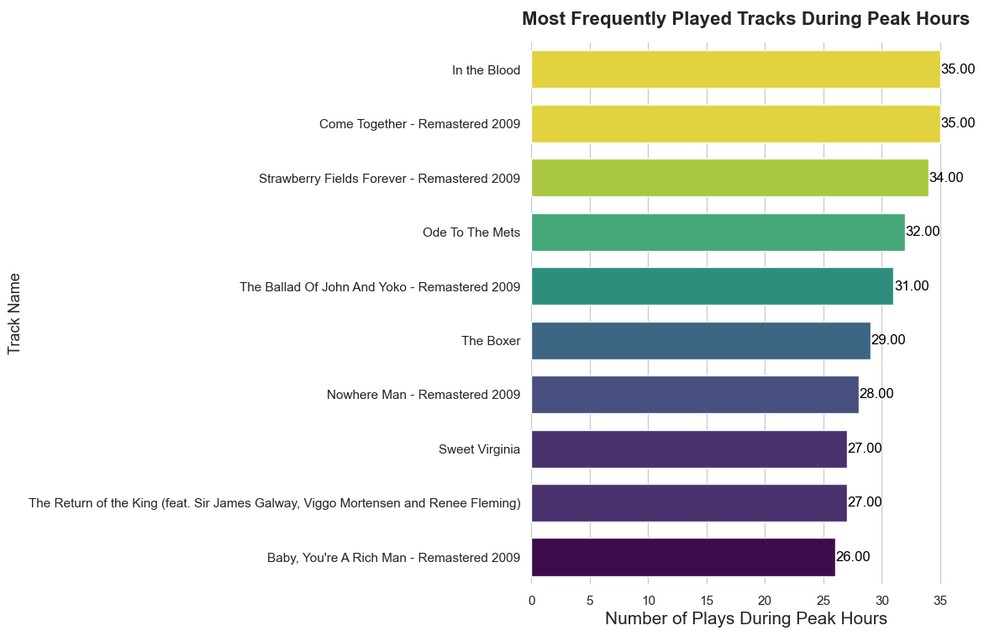

# Spotify User Engagement Enhancement: Data-Driven Insights and Recommendations 🎵

## **Project Overview:**

This project delves into Spotify's user engagement, aiming to optimize shuffle mode and boost track completion rates. We leverage data analysis to understand user listening behavior, shuffle mode impact, track completion patterns, and platform usage trends, providing actionable recommendations to enhance the user experience. 🎧

## **Business Use Case:**

User engagement is paramount to Spotify's success.  By understanding user behavior, Spotify can:

* **Increase user satisfaction:** A personalized and seamless listening experience leads to happier users. 😊
* **Boost platform usage:** Higher engagement translates to more listening hours and potentially increased revenue. 💰
* **Improve content strategy:** Insights into popular tracks and listening patterns inform content acquisition and curation. 🎶
* **Gain a competitive edge:** Continuous user experience optimization differentiates Spotify in the competitive market. 🚀

## **Project Methodology:**

1. **Data Collection:** We utilize a dataset of user streaming activity, including timestamps, track details, shuffle mode, platform information, and interruption reasons. 📥
2. **Data Cleaning and Preprocessing:** SQL is employed to clean and preprocess the raw data, handling missing values and inconsistencies. 🧹
3. **Exploratory Data Analysis (EDA):** In-depth EDA is performed using SQL and Python (with Pandas, Matplotlib, and Seaborn) to uncover patterns and trends. 📊
4. **Insight Generation:** We analyze the EDA results to extract meaningful insights related to shuffle mode, track completion, platform preferences, and listening behavior. 💡
5. **Recommendation Development:** Data-driven recommendations are developed to improve user engagement and platform optimization. 🎯

## **Dataset Column Description:**

| Column Name        | Description                                                                  |
|-------------------|------------------------------------------------------------------------------|
| `ts`              | Timestamp of the streaming event.                                            |
| `spotify_track_url` | Unique identifier for the track.                                            |
| `track_name`       | Name of the track.                                                         |
| `artist_name`      | Name of the artist.                                                        |
| `ms_played`       | Milliseconds the track was played.                                            |
| `platform`         | Platform used for streaming (e.g., Android, iOS, Windows).                     |
| `shuffle`          | Boolean indicating if shuffle mode was enabled.                               |
| `reason_start`     | Reason for starting the track (e.g., "fwdbtn", "backbtn", "playbtn").          |
| `reason_end`       | Reason for ending the track (e.g., "fwdbtn", "end of track", "logout").       |
| `skipped`       | Boolean indicating if track was skipped.                                                            |

## **Key Insights & Recommendations:**

### **1. Impact of Shuffle Mode on Listening Behavior:**

* **Diversity:** Shuffle mode usage correlates with *lower* track diversity. 
    * **Visualization:** 
        * Python:   
        * SQL:  
    * **Recommendation:** Explore methods to enhance diversity in shuffle mode (personalized recommendations, genre diversification). 💡
* **Interruptions:** Shuffle mode leads to significantly *higher* track interruption rates.
    * **Visualization:**
        * Python: 
        * SQL: 
    * **Recommendation:** Investigate interruption reasons and optimize shuffle algorithms for user satisfaction. 🧐
* **Platform Usage:** Android users exhibit the highest shuffle mode usage.
    * **Visualization:**
        * Python: 
        * SQL: 
    * **Recommendation:** Prioritize shuffle mode optimization for Android, while considering usage on other platforms. 📱

### **2. Track Completion Rates:**

* **Overall:** Completion rates are slightly higher than interruption rates, but improvement is needed.
    * **Visualization:**
        * Python: 
        * SQL: 
    * **Recommendation:** Focus on reducing interruptions to improve completion rates. 📈
* **Track/Artist Specific:** Specific tracks and artists have high interruption rates.
    * **Visualization:**
        * Python: 
        * SQL: 
    * **Recommendation:** Investigate and address issues with these tracks (quality, preference mismatch). 🕵️‍♀️
* **Platform Influence:** Mac users have the highest completion rates; "cast to device" users prefer non-shuffle mode.
    * **Visualization:**
        * Python: 
        * SQL: 
    * **Recommendation:** Tailor platform-specific features based on user preferences. 💻

### **3. Platform Usage Trends:**

* **Playback Duration:** Mac users have the longest average playback duration.
    * **Visualization:**
        * Python: 
        * SQL: 
    * **Recommendation:** Analyze Mac user behavior and replicate successful patterns on other platforms. 🧐
* **Peak Usage:** Usage peaks on Friday evenings and late nights/early mornings.
    * **Visualization:**
        * Python: 
        * SQL: 
    * **Recommendation:** Optimize ad delivery and content promotion during peak hours. 📢

### **4. Timestamp-Based Insights:**

* **Popular Hours:** Peak streaming hours vary across platforms.
    * **Visualization:**
        * Python: 
        * SQL: 
    * **Recommendation:** Personalize content recommendations based on platform-specific peak hours. ⏰
* **Peak Hour Tracks:** Specific tracks are popular during peak hours.
    * **Visualization:**
        * Python: 
        * SQL: 
    * **Recommendation:** Curate playlists and promotions around these tracks during their peak hours. 🎶

## **Code and File Structure:**

The repository contains the following files:

* **`.ipynb_checkpoints`:** Jupyter Notebook checkpoints (for version control).
* **`Business_Analysis.ipynb`:** Jupyter Notebook containing the detailed business analysis, insights, and recommendations.
* **`EDA.ipynb`:** Jupyter Notebook with exploratory data analysis code and visualizations.
* **`ETL.ipynb`:** Jupyter Notebook detailing the data extraction, transformation, and loading process.
* **`data_cleaning.sql`:** SQL script for data cleaning and preprocessing.
* **`initial_data_understanding.sql`:** SQL script for initial data understanding and exploration.
* **`spotify_dataset.csv`:** The Spotify dataset used for the analysis.

## **Sequential Guide to Exploring the Project:**

1. **Start with `initial_data_understanding.sql`:** This script provides a first look at the dataset's structure and content.
2. **Proceed to `data_cleaning.sql`:** This script outlines the data cleaning and preprocessing steps.
3. **Explore `ETL.ipynb`:** This notebook explains the data pipeline and how the data was prepared for analysis.
4. **Dive into `EDA.ipynb`:** This notebook contains the exploratory data analysis, visualizations, and initial insights.
5. **Finally, review `Business_Analysis.ipynb`:** This notebook consolidates the key insights and provides the final recommendations for Spotify.

**Note:** The `spotify_dataset.csv` file was downloaded using a Python script in the **`ETL.ipynb`** file, demonstrating data acquisition capabilities.

## **Conclusion:**

This project empowers Spotify with insights to enhance user engagement. By implementing our recommendations, Spotify can optimize shuffle mode, improve completion rates, and personalize the listening experience.  Data-driven decision-making and continuous monitoring are crucial for success. 🚀

---

## **Follow Me!** 👋

I'd love to connect with you on social media and share more about my data science projects!

* **LinkedIn:** [https://www.linkedin.com/in/richard-muchoki-2408b7205/] 
* **GitHub:** [https://github.com/Equivocal-Richie/] 

---

